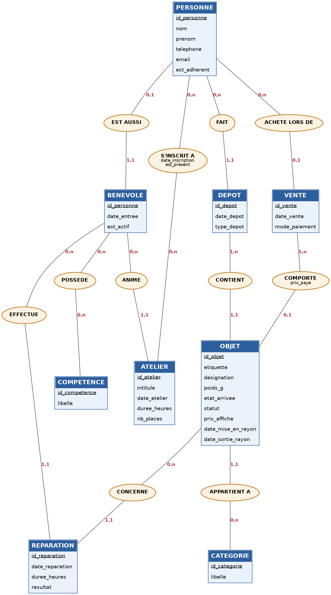

# AdaDatabase — La Remise

La Remise est une ressourcerie : elle collecte des objets, les répare, les revend
et organise des ateliers. Ce dépôt contient la base PostgreSQL qui gère tout ça.

## Lancer

```bash
docker compose up -d --wait
docker exec -i laremise_db psql -U remise -d laremise < migration_up.sql
docker exec -i laremise_db psql -U remise -d laremise < seed.sql
```

Port 5433, base `laremise`, identifiants `remise` / `remise`.

Les 10 requêtes du client :

```bash
docker exec -i laremise_db psql -U remise -d laremise < queries.sql
```

## Les fichiers

```
conception/     dictionnaire, décisions, schémas, passage au relationnel
migration_up.sql / migration_down.sql
seed.sql        26 personnes, 40 objets, 15 réparations, 10 ventes, 4 ateliers
queries.sql     les 10 questions, commentées, avec leurs résultats
```

## Le modèle



11 tables, créées dans cet ordre :

1. `personne`, `categorie`, `competence`
2. `benevole`, `depot`, `vente`
3. `objet`, `benevole_competence`, `atelier`
4. `reparation`, `inscription`

Trois choix que j'ai eu à faire :

- Une seule table `personne`. Un bénévole peut aussi donner un objet ou acheter :
  quatre tables auraient dupliqué les mêmes gens.
- `reparation` est une table à part entière, pas une liaison. Un bénévole peut
  réparer deux fois le même objet.
- Pas de table `ligne_vente`. Un objet n'est vendu qu'une fois, donc `id_vente`
  et `prix_paye` sont dans `objet`.

Le détail est dans `conception/decisions.md`.

## Vérifier

Le script doit pouvoir tourner deux fois de suite sans erreur :

```bash
docker exec -i laremise_db psql -U remise -d laremise < migration_down.sql
docker exec -i laremise_db psql -U remise -d laremise < migration_up.sql
docker exec -it laremise_db psql -U remise -d laremise -c "\dt"
```

11 tables.

Depuis un dépôt fraîchement cloné :

```bash
docker compose down -v
docker compose up -d --wait
```

Puis les commandes de la section *Lancer*.
